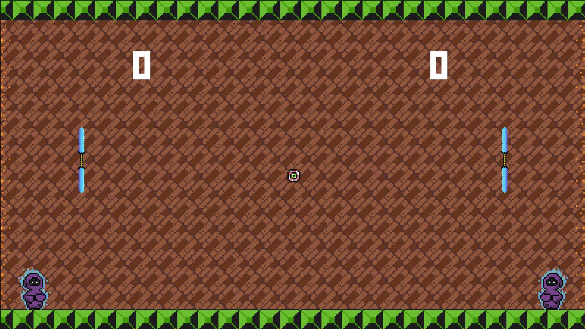

# Parry Pong

## About Me

Hello! I am Lin, a passionate game developer with a love for creating engaging experiences. I have a background in Unity as well as Web Development and I enjoy bringing my ideas to life. You can connect with me on [LinkedIn](https://www.linkedin.com/in/collin-ballard), [LinkWithLin](https://www.linkwithlin.com/), and check out my [Portfolio Project Repository](https://github.com/Collinb190).

## Introduction

**Parry Pong** is a 2D platformer game developed in Unity. In this game, you play as Clio, who discovers that her idyllic natural life is nothing more than a simulation. Players must navigate through various levels, overcoming obstacles and enemies to collect three coins and unlock the exit. The game features vibrant graphics, engaging animations, and a challenging environment that tests your skills. Can you help Clio escape back to reality? 

## Table of Contents

1. [Features](#features)
2. [Getting Started](#getting-started)
3. [Controls](#controls)
4. [Authors](#authors)
5. [License](#license)

## Features

- **Health**: Clio starts with 3 lives. Fall off the map, and you die. Take 3 hits, you die.
- **Boars**: Flying boars will fly at you to prevent you from escaping the simulation. 
- **Coins**: Collect 3 coins to unlock the exit!  
- **Movement**: Clio can jump and move left to right, with fully animated run and jump cycles. 
- **Attack**: Clio can kill boars by jumping up into them from underneath. Jump on top like a Goomba, and it'll just hurt Clio!

## Getting Started

You can download the completed game from this link: [Parry Pong Zip](https://github.com/Collinb190/Woodland)
- Save **ParryPong.zip** to your desired location.
- Unzip **ParryPong.zip**.
- Double-click **ParryPong.exe** and have fun!

### Prerequisites

Works on PC, Mac, and Linux

## Controls

| Key    | Action       |
|--------|--------------|
| W      | Move Up      |
| S      | Move Down    |
| Space  | Parry        |

## Authors

Collin Ballard [https://github.com/Collinb190]

## License

No formal license is required; feel free to play this game for personal enjoyment!
